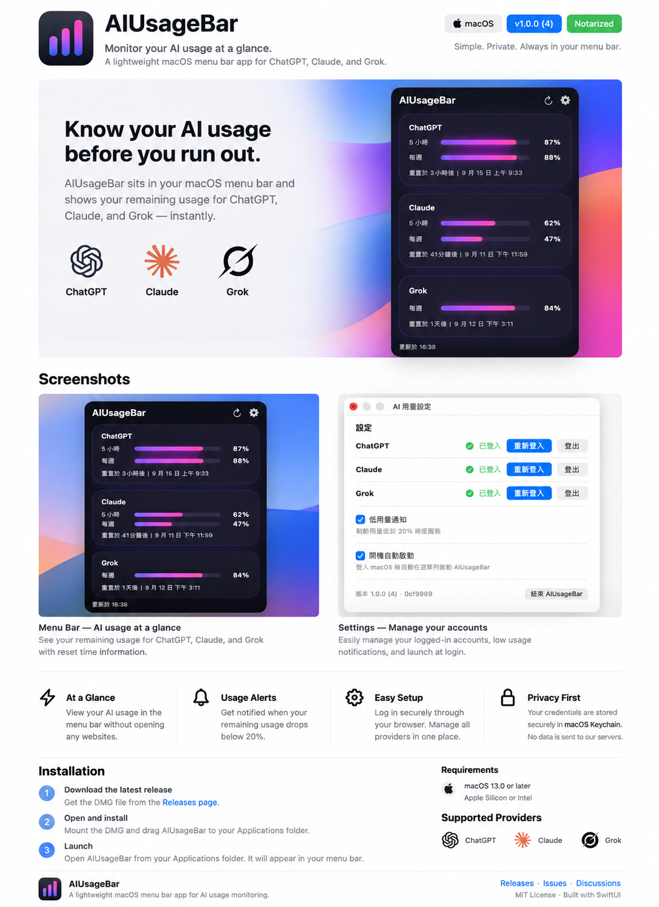
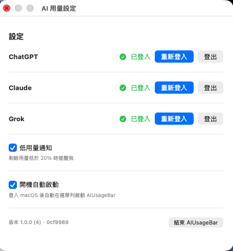

# AIUsageBar

AIUsageBar 是一個輕量的 macOS 選單列 App，讓你不用開啟各家網站，就能快速查看 AI 用量剩餘多少。



## v1.0.0 現況

- 目前 UI 為**繁體中文**。
- 目前支援 **ChatGPT、Claude、Grok**。
- 顯示各 provider 可取得的剩餘用量、用量週期與重置時間。
- 正式版已提供 Apple notarized DMG，可直接下載安裝。

## 主要功能

- 常駐 macOS 選單列，快速查看 AI 用量。
- ChatGPT、Claude、Grok 用量整合在同一個面板。
- 顯示 ChatGPT 與 Claude 的 5 小時／每週用量，以及 Grok 的每週用量。
- 自動重新整理用量資料。
- 剩餘用量低於 20% 時顯示低用量通知。
- 支援「開機自動啟動」。
- 使用 macOS Keychain 儲存登入憑證與 session token。
- 以 SwiftUI 與原生 macOS 元件打造。

## 下載 v1.0.0

- [下載 AIUsageBar v1.0.0 notarized DMG](https://github.com/synok522-del/AIUsageBar/releases/download/v1.0.0/AIUsageBar-1.0.0-build4-main-0cf9989-notarized.dmg)
- [查看 GitHub v1.0.0 Release](https://github.com/synok522-del/AIUsageBar/releases/tag/v1.0.0)

這個正式 DMG 是 `AIUsageBar 1.0.0 (4)` 的 Developer ID 發佈版本，已完成 Apple notarization、staple 與 Gatekeeper 驗證。若要確認下載檔案完整性，可比對 SHA-256：

```text
266a1e904d412f53bed195df9b5d81025c57adaa33ec42b001d9c7676ecf1fac
```

## 系統需求

- macOS 13.0 或以上。
- 需要有對應 provider 的 ChatGPT、Claude 或 Grok 帳號，才能查看該服務的用量。

## 安裝方式

1. 從上方連結下載正式 `v1.0.0` DMG。
2. 開啟 DMG，將 `AIUsageBar.app` 拖曳到「Applications／應用程式」資料夾。
3. 從「Applications／應用程式」啟動 AIUsageBar；App 會出現在 macOS 選單列。
4. 開啟「設定」，分別登入要使用的 ChatGPT、Claude 或 Grok，並依需求開啟低用量通知與開機自動啟動。

## 畫面預覽

### 選單列用量面板


主面板會集中顯示 ChatGPT、Claude 與 Grok 的剩餘用量，以及對應的重置時間。

### 帳號與 App 設定



可在同一個設定視窗管理三個 provider 的登入狀態、重新登入、登出、低用量通知與開機自動啟動。

### macOS 選單列圖示


## 隱私與資料安全

- 登入憑證與 session token 儲存在本機 macOS Keychain。
- 登入流程使用各 provider 的網站與 App 內 WebKit session；網站 cookie 保留在本機 WebKit 資料儲存區。
- 用量資料直接從 App 使用的 provider endpoint 取得。
- 目前專案沒有 AIUsageBar 後端或 analytics endpoint；不會刻意將登入憑證上傳到 AIUsageBar 伺服器。

## 注意事項

AIUsageBar 是獨立專案，與 OpenAI、Anthropic 或 xAI 沒有隸屬、背書或贊助關係。ChatGPT、Claude 與 Grok 名稱僅用於標示相容的服務。

Provider 的網站、登入流程、cookie 或 endpoint 若發生變更，可能影響登入或用量讀取結果。
