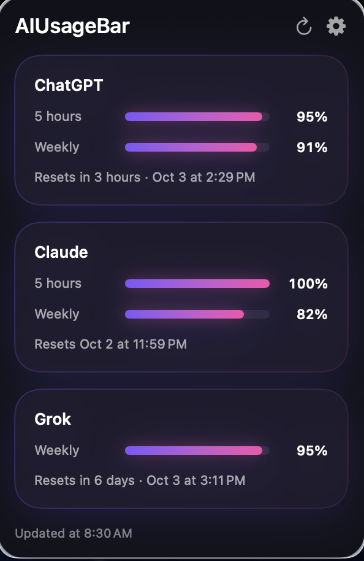
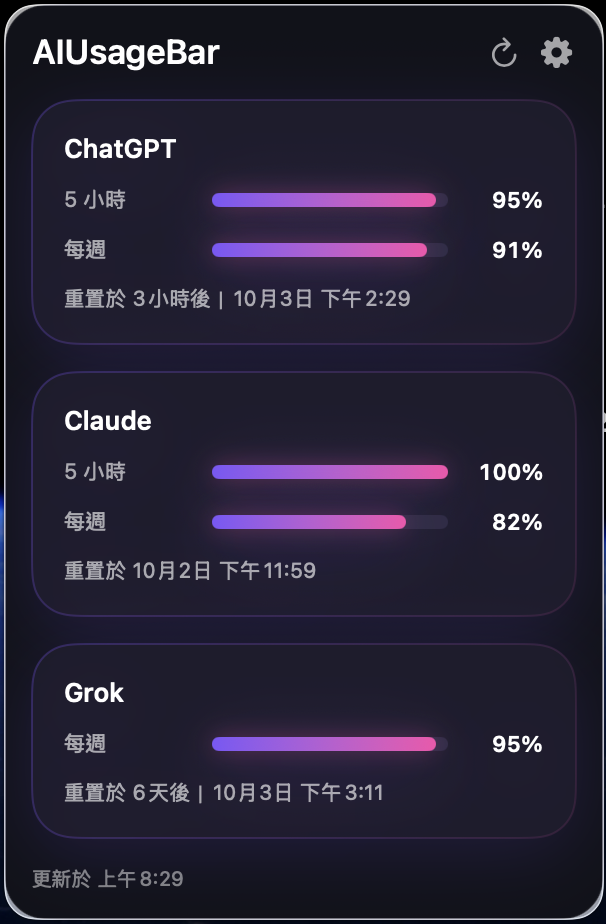
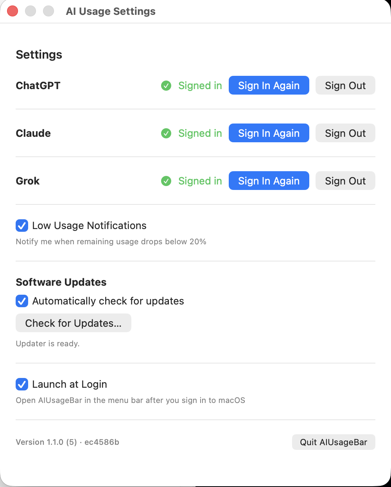
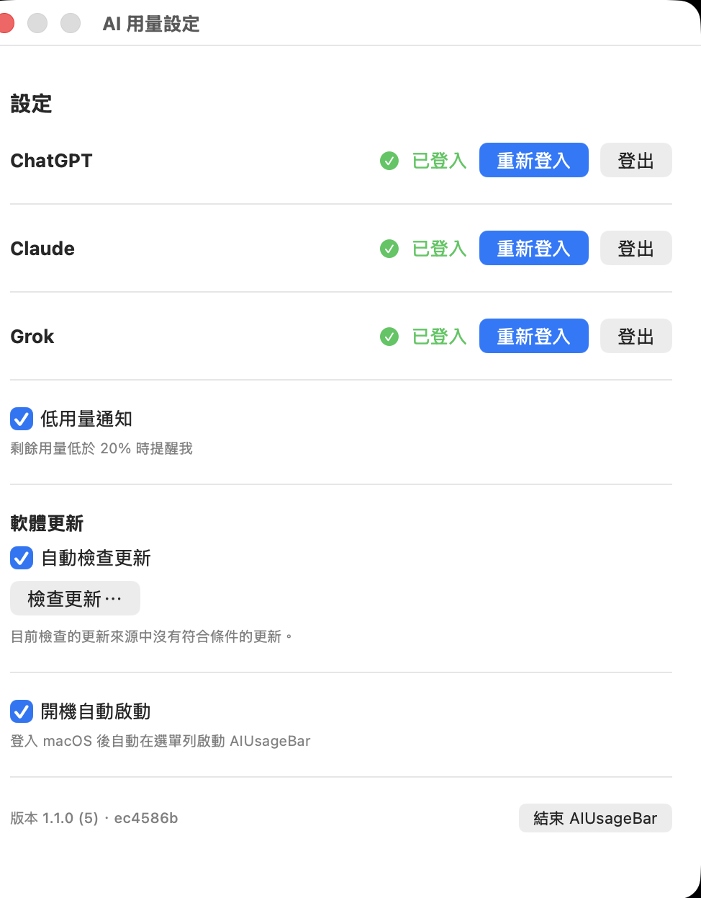

# AIUsageBar

AIUsageBar is a native macOS menu bar app for checking your remaining AI usage without repeatedly opening provider websites.

AIUsageBar 是原生 macOS 選單列 App，讓你快速查看 AI 服務剩餘用量，不必反覆開啟各服務網站。

**Current production release / 目前正式版：AIUsageBar v1.1.0 (Build 5)**

## Download / 下載

- [Download the official Build 5 DMG, `AIUsageBar-1.1.0-build5.dmg`](https://github.com/synok522-del/AIUsageBar/releases/download/v1.1.0/AIUsageBar-1.1.0-build5.dmg)
- [GitHub Release and release notes / GitHub 發布頁與版本說明](https://github.com/synok522-del/AIUsageBar/releases/tag/v1.1.0)

- DMG SHA-256: `fcef7da669c56ada976f76550f4638eadc3b4a6dab4b28b9e16da0bc9f5919e2`
- Build source revision / 建置來源版本：`ec4586b62e23a6098fc7247ec9f34b6915d8366f`

Requires macOS 13 or later. Open the DMG and drag `AIUsageBar.app` to Applications.

系統需求為 macOS 13 以上。打開 DMG，將 `AIUsageBar.app` 拖到「應用程式」資料夾即可安裝。

## Features / 功能

- Check remaining usage, available usage periods, and reset times in one menu bar panel.
- Refresh usage automatically and optionally receive low-usage notifications.
- Use the app in English or Traditional Chinese.
- 在同一個選單列面板查看剩餘用量、可用的用量週期與重置時間。
- 可自動更新用量，並選擇接收低用量通知。
- 支援英文與繁體中文介面。

## Supported Providers / 支援服務

AIUsageBar currently supports **ChatGPT, Claude, and Grok**. Available usage details depend on each provider and account. Provider websites and sign-in methods can change, so occasional sign-in may be required.

目前支援 **ChatGPT、Claude 與 Grok**。可顯示的用量資訊依各服務與帳戶而異。服務網站或登入方式變更時，偶爾可能需要重新登入。

## Software Updates / 軟體更新

Build 5 is the first production release that includes an in-app updater connected to the production update feed. In **Settings → Software Updates**, you can enable **Automatically check for updates** or choose **Check for Updates…** to check manually. Update availability and status appear in Settings. Build 4 and earlier do not include the updater, so they must be manually updated to Build 5 once. Starting with Build 5, later releases can be checked and installed from inside the app through the production Sparkle update channel.

Build 5 是第一個正式提供 App 內更新程式的版本。在「設定 → 軟體更新」中，可開啟「自動檢查更新」，或按「檢查更新⋯」手動檢查；更新是否可用與目前狀態會顯示在設定中。Build 4 及更早版本沒有更新程式，因此需要先手動下載並安裝一次 Build 5。從 Build 5 起，後續版本可透過正式版 Sparkle 更新頻道，在 App 內檢查並安裝。

## Screenshots / 畫面截圖

### Usage panels / 用量面板





### Settings / 設定





## Privacy / 隱私

Sign-in credentials and provider session tokens used by the app are stored locally in macOS Keychain. Provider website cookies may also remain in the local WebKit data store used for sign-in. The app communicates directly with each provider to retrieve usage; the project does not operate a backend or analytics endpoint, and these data are not sent to an AIUsageBar-operated server.

登入憑證與 App 使用的服務工作階段 Token 保存在本機 macOS 鑰匙圈。服務網站 Cookie 也可能留存在登入時使用的本機 WebKit 資料儲存區。App 會直接向各服務查詢用量；本專案不營運後端或分析端點，這些資料不會傳送至 AIUsageBar 營運的伺服器。

AIUsageBar is an independent project and is not affiliated with, endorsed by, or sponsored by OpenAI, Anthropic, or xAI.

AIUsageBar 為獨立專案，與 OpenAI、Anthropic 或 xAI 無隸屬、背書或贊助關係。

## Development / 開發

To open the Build 5 source revision in Xcode:

```sh
git clone https://github.com/synok522-del/AIUsageBar.git
cd AIUsageBar
git checkout ec4586b62e23a6098fc7247ec9f34b6915d8366f
open AIUsageBar.xcodeproj
```

An Xcode development build is not the signed production DMG. Xcode 開發版並非已簽署的正式 DMG。
