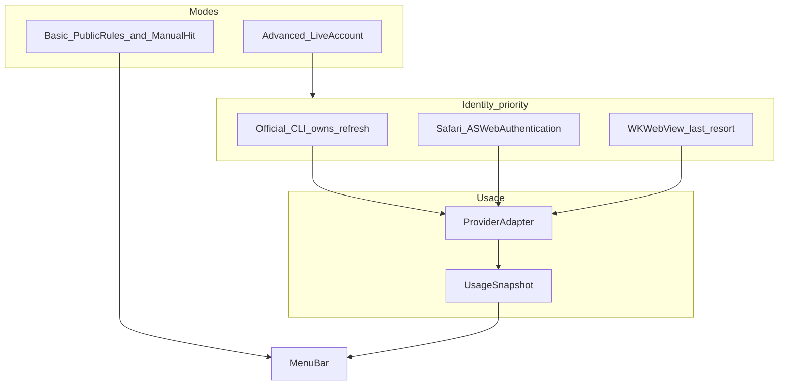

# AI Usage Tracking Architecture Research 2026

**Product:** AIUsageBar (macOS Menu Bar)  
**Date:** 2026-09-06  
**Scope:** Architecture research only. No product code changes in this revision.  
**Question:** Is there a more stable, more secure, lower-maintenance way than the current local Web Session / cookie method to obtain account-specific Remaining Usage, Usage %, short-window limit, weekly limit, and reset time for AI Chat and AI Coding tools?

## Evidence standard

Every important claim is tagged:

- **CONFIRMED** — official docs, official source repositories, or this repo’s current code
- **LIKELY** — high-quality independent technical evidence, first-party client behavior, or consistent community reverse-engineering
- **POSSIBLE** — plausible but thin evidence
- **NOT VERIFIED** — needs a live login / live packet capture on a real account

This report **does not** treat API billing as ChatGPT / Claude / Cursor consumer subscription usage.  
This report **does not** treat a published quota duration as an account-specific reset timestamp.  
This report **does not** recommend stealing browser credentials, disabling TLS, MITM proxies, accessibility abuse, or unsafe credential extraction.

---

## Executive Recommendation

If AIUsageBar is redesigned today, **WKWebView cookie snapshot should not be the default identity layer**.

The product goal is unchanged: answer “how much AI quota do I have left?” and “when does it reset?” with **account-specific** numbers. That goal is correct. The current *data source* (private website usage endpoints) is often still the only place those numbers exist. The current *identity layer* (Keychain-stored website cookies plus hidden WebKit recovery) is the part that is already failing in production.

**Recommended architecture: Hybrid Identity + Usage Adapter, with Basic Mode and Advanced Mode.**

- **Basic Mode** — no login. Public limit/reset rules plus optional manual “I hit the limit” countdown.
- **Advanced Mode** — live account usage. Identity is obtained in this order:
  1. Official CLI / desktop tool already signed in on this Mac (CLI owns token refresh)
  2. Safari `ASWebAuthenticationSession` / CLI-equivalent OAuth (password typed on the provider site, refresh token stored locally)
  3. Current WKWebView website session — **last resort only**
- Usage fetch still talks to provider usage surfaces, but AIUsageBar **stops owning browser session lifecycle** wherever a refresh-token identity exists.

Why this is better than “every provider uses Web Session”:

1. **CONFIRMED** in this repo: ChatGPT stores a next-auth cookie snapshot, exchanges it for a short-lived access token, then calls `GET https://chatgpt.com/backend-api/wham/usage`. The access token is not persisted. Overnight, the cookie snapshot can exist in Keychain while `/api/auth/session` fails. ChatGPT currently has **no** hidden-WKWebView recovery path.
2. **CONFIRMED** in this repo: Grok already hit overnight WAF / stale WebKit context. Recovery latches READY when navigation finishes **and** a grok.com `sso` cookie exists. Cookie existence is not proof that a usage request will succeed.
3. **CONFIRMED** from official sources: Codex, Claude Code, Grok CLI, Gemini CLI, and Cursor already maintain refresh-token identities on disk or in Keychain. Those identities are designed to survive overnight. Website cookies are not.
4. There is **no** third-party public “usage-only” API with a compatibility guarantee for consumer ChatGPT / Claude Pro / Grok SuperGrok / Cursor / Gemini Apps. **CONFIRMED** by absence in official public API docs, plus first-party clients using unpublished routes.

Direct answers to the nine product questions are in the last section. The one-sentence conclusion is:

> 如果今天從零開始重新做 AIUsageBar，我會採用 **CLI/OAuth 身分複用 + Provider Adapter + Basic/Advanced Mode** 架構，因為 refresh token / 官方 CLI 擁有 session lifecycle，能拿到真實 Remaining 與 Reset，同時避開 WKWebView cookie snapshot 與 overnight expiry。

---

## AI Limit — How It Actually Works

No single App Store listing was found that simultaneously matches **all** of:

- exact name “AI Limit”
- “does not connect to AI accounts”
- reset data taken only from public information
- App Store Privacy Nutrition Label “Data Not Collected”

What exists in 2026 is a cluster of similarly named competitors. Several of them advertise privacy in a way that is easy to misread. Apple’s “Data Not Collected” label means **the developer claims not to collect data for themselves**. It does **not** mean the app never talks to OpenAI, Anthropic, xAI, or Cursor.

### Limits — getlimits.app (closest well-documented product)

**CONFIRMED** from the official site [https://getlimits.app/](https://getlimits.app/) and App Store listing [Limits: AI Usage Tracker](https://apps.apple.com/us/app/limits-ai-usage-tracker/id6783130074) (id `6783130074`, developer contact `hi@pranavkarthik.com`).

| Claim | Reality |
| --- | --- |
| No Limits account | **CONFIRMED.** Author says tokens stay on device in Keychain; nothing routes through the author’s server. |
| No API key required | **CONFIRMED** for the coding-tool connections described. |
| Does not read chats | **CONFIRMED** as a product claim: connection is used only to retrieve usage and basic account information. |
| Does not connect AI accounts | **False.** It **does** connect. The author wanted in-app WebView login; providers blocked it. Limits opens the **real Safari login**. The user types the password into the provider, and Limits receives the token. |
| Reset data from public information | **False for connected providers.** It shows session usage, weekly quotas, and live reset countdowns from the connected account. |
| Knows actual Remaining | **YES**, for connected providers. This is **ACTUAL ACCOUNT USAGE**, not a public-rule countdown. |
| Data Not Collected | **LIKELY** as an Apple Nutrition Label about *developer* collection. The app still sends tokens to provider usage endpoints. |

How Limits connects (**CONFIRMED** from getlimits.app):

- **Claude Code** — authorize on Claude’s sign-in page in Safari, then paste the authorization code. Scopes listed: `org:create_api_key`, `user:profile`. Author emphasizes these are **not** `user:inference`, so Limits cannot spend usage generating code.
- **Codex** — Sign in to ChatGPT in Safari; Limits catches the redirect. Scopes listed: `openid`, `profile`, `email`, `offline_access`, `api.connectors.read`, `api.connectors.invoke`. Author says these mirror Codex CLI and are used only to read Codex rate-limit usage.
- **Cursor** — approve Cursor’s own login page; a token is returned. Author says **no OAuth scopes are requested**.
- **Grok** — sign in with an X account on xAI’s page; local redirect after Grok CLI OAuth. Scopes listed: `openid`, `profile`, `email`, `offline_access`, `grok-cli:access`, `api:access`.
- **Antigravity** — Google installed-app OAuth. Google `cloud-platform` scope is broad; author says Limits only reads identity, quota, and plan.

What this product actually knows: **actual used / remaining percentages and provider-reported reset times**, cached on device so Home Screen / Lock Screen widgets can keep counting between iOS refresh budgets.

### Other similarly named apps

**AI Limits** (Yevhen Lapshyn, App Store id `6782970335`) — **CONFIRMED** it **does** connect. App Store copy: sign in on each provider’s official page inside the app, or add an API key. It mixes consumer limits **and** API balance / monthly spend. Do not treat it as a public-rules-only app, and do not treat its API spend cards as ChatGPT / Claude subscription remaining.

**AI Limits & Reset Tracker** (Inovantis, id `6758946226`) — **CONFIRMED** it connects multiple providers (Claude, ChatGPT/Codex, Cursor, Copilot, and others). Privacy copy indicates some data may be collected but not linked to identity. This is **not** “Data Not Collected.”

**VibeCheck** (id `6759708342`) — **CONFIRMED** Mac menu-bar companion plus iPhone app. Mac collects usage from provider APIs / CLIs; iPhone receives normalized snapshots over the local network. App Store states the developer does not collect data. This is a **local companion** architecture, not a public-rules app.

**LimitWatch** — **CONFIRMED** from App Store copy that a Mac companion installs hooks into coding tools and syncs via iCloud. Broader than quota (session events, approvals). Different product.

**Reset Meter** ([RZDESIGN/reset-meter](https://github.com/RZDESIGN/reset-meter)) — **CONFIRMED** open-source macOS menu bar. Codex via `account/rateLimits/read`; Claude via Desktop `plan-usage-history.json`; Cursor via local token + current-period usage. Not an iPhone public-rules app.

**AI Limit Status** ([farhans-codes/ai_limit_status](https://github.com/farhans-codes/ai_limit_status)) — **CONFIRMED** desktop companion. Codex usage through locally installed `codex app-server` (does not copy Codex credentials). Claude usage from Keychain `Claude Code-credentials` / `.credentials.json` calling `https://api.anthropic.com/api/oauth/usage`.

### What a true public-rules “AI Limit” can and cannot know

If an app truly never connects an account:

| Capability | Possible? |
| --- | --- |
| Public window duration (5 hours, 7 days, monthly billing cycle) | Yes |
| Public plan marketing ranges (“Plus has a 5-hour window”) | Yes |
| Local countdown after the user taps “I hit the limit” | Approximate |
| Account-specific remaining % | **No** |
| Account-specific reset timestamp for a rolling window | **No** — there is no window anchor |
| Distinguishing “73% remaining” from “the window is 5 hours” | **No** |

**CONFIRMED** from Google’s Gemini Apps help: limits are compute-based and refresh every five hours until a weekly cap. Public docs do not publish the user’s remaining fraction.  
**CONFIRMED** from OpenAI Codex pricing docs: local messages and cloud chats can share a five-hour window; additional weekly limits may apply; public pages give ranges, not the user’s remaining %.  
**CONFIRMED** from Cursor help: usage resets monthly on the **account billing cycle**, shown on the Spending tab — not a universal calendar date.

### What AIUsageBar should copy from this category

Copy:

1. A no-login **Basic Mode** that never pretends to know Remaining.
2. Safari / system-browser OAuth instead of in-app WKWebView login, because providers already block or expire WebView sessions.
3. No AIUsageBar account, no analytics, tokens only on device.
4. Cache last good usage so the UI can keep a countdown while marking it stale.
5. For Claude-style OAuth, avoid inference scopes if a narrower identity/profile scope is enough to read usage.

Do **not** copy:

- Marketing that sounds like “we don’t connect accounts” while the app actually does.
- Mixing API billing cards into consumer remaining.
- Treating Apple “Data Not Collected” as proof that no provider traffic occurs.

---

## AIUsageBar Current Architecture Assessment

### Product intent

**CONFIRMED** from `README.md` and current Swift sources: AIUsageBar is a local macOS menu bar app. It does not require an AIUsageBar account. It does not upload credentials to an AIUsageBar server. It does not read chat contents. Credentials live in the macOS Keychain. Distribution today is a signed Developer ID DMG, **not** the Mac App Store. App Sandbox is disabled.

Current beta code supports ChatGPT, Claude, and Grok. README still advertises ChatGPT and Claude only; Grok is implemented in source.

### Method: local web session

```text
WKWebView login on the official site
  → extract website session / cookies
  → store a snapshot in Keychain
  → URLSession calls the same usage endpoints the website uses
  → parse remaining % and reset
```

No API key. No central credential server. This is why the method can see **account-specific** remaining rather than public quota rules.

### ChatGPT — current code path

**CONFIRMED** in [`AIUsageBar/Service/ChatGPTService.swift`](../AIUsageBar/Service/ChatGPTService.swift) and [`UsageViewModel.swift`](../AIUsageBar/ViewModels/UsageViewModel.swift):

1. WKWebView login on chatgpt.com / openai.com.
2. Persist `__Secure-next-auth.session-token` (and a cookie header) in Keychain.
3. Refresh: Cookie → `GET https://chatgpt.com/api/auth/session` → `accessToken` (memory only).
4. `GET https://chatgpt.com/backend-api/wham/usage` with `Authorization: Bearer <accessToken>`.
5. Parse `rate_limit.primary_window.used_percent` and `reset_at` as the short window; `secondary_window` as weekly.

This **does** obtain actual remaining and reset when the cookie still works.  
[`refreshChatGPT()`](../AIUsageBar/ViewModels/UsageViewModel.swift) has **no** hidden WKWebView recovery. Auth failure becomes “登入已失效，請重新登入” while last-known usage can remain on screen.

### Claude — current code path

**CONFIRMED** in [`ClaudeService.swift`](../AIUsageBar/Service/ClaudeService.swift):

1. WKWebView on claude.ai / anthropic.com.
2. Persist `sessionKey`.
3. `GET https://claude.ai/api/organizations` with `Cookie: sessionKey=...`.
4. `GET https://claude.ai/api/organizations/{id}/usage`.
5. Parse `five_hour.utilization` / `resets_at` and `seven_day.utilization` / `resets_at`.

Relative stability in production is real. It is still a **private web API** plus a cookie snapshot. Do not assume it cannot gain a ChatGPT-like lifecycle bug later.

### Grok — current code path

**CONFIRMED** in [`GrokService.swift`](../AIUsageBar/Service/GrokService.swift), [`WebSessionManager.swift`](../AIUsageBar/Service/WebSessionManager.swift), [`GrokWebKitSessionRestorer.swift`](../AIUsageBar/Service/GrokWebKitSessionRestorer.swift), [`GrokSessionRecovery.swift`](../AIUsageBar/Service/GrokSessionRecovery.swift):

- Identity: grok.com WebKit cookies, with Keychain `sso` / cookie-header fallback.
- Short window: `POST https://grok.com/rest/rate-limits` with `{ "modelName": "grok-3" }`. Remaining = `remainingQueries / totalQueries`.
- Weekly: `POST https://grok.com/grok_api_v2.GrokBuildBilling/GetGrokCreditsConfig` (gRPC-Web protobuf). `credit_usage_percent` is used %; remaining = 100 − used; weekly reset is `current_period.end` when `current_period.type == WEEKLY`. **`billing_period_end` is not weekly reset** — already confirmed in-product.
- Recovery: hidden WKWebView loads `https://grok.com/`, READY only if navigation finishes and an `sso` cookie exists; WAF or HTTP 401 can restore once and retry once; logout bumps generation.

This is the most complex session machine in the app, and it still cannot prove “usage will succeed” from “cookie exists.”

### What the current method gets right

1. No API key.
2. Account-specific remaining % and reset — when auth works.
3. Consumer subscription quota, not Platform API billing.
4. No AIUsageBar account.
5. Credentials stay on the Mac.
6. No AIUsageBar credential server.

### What it gets wrong as a long-term architecture

Website endpoints are unpublished. Cookies expire. WAF binds to browser process context. WKWebView is a second browser, not the user’s Safari session. Account switch / logout / recovery races are inherent. Each provider needs separate reverse engineering. App Store privacy explanations become harder if this is later submitted to MAS.

The right diagnosis: **the usage payloads are good; the identity abstraction is wrong.**

---

## Why Our Current Session Problems Happen

### ChatGPT overnight expiry

**CONFIRMED** production symptom: yesterday ChatGPT worked; overnight ChatGPT still shows last-known usage; refresh is an auth failure; Claude / Grok may still work; Logout → Login restores ChatGPT immediately.

Root cause is not Keychain corruption. Keychain correctly stored the login-time next-auth cookie. The website session lifecycle moved on.

```text
Keychain credential exists
    ≠
Live chatgpt.com session can mint an accessToken
    ≠
GET /backend-api/wham/usage returns account usage
```

**CONFIRMED** code shape: cookie snapshot → `/api/auth/session` → ephemeral access token. There is no refresh token in AIUsageBar’s ChatGPT storage. Official Codex auth, by contrast, stores a refreshable token bundle and refreshes it in place (**CONFIRMED**: [ChatGPT Learn — Authentication](https://learn.chatgpt.com/docs/auth), [CI/CD auth](https://learn.chatgpt.com/docs/auth/ci-cd-auth)).

Hidden WKWebView recovery, if added the same way as Grok, does **not** fix this by itself. Independent review is correct:

```text
COOKIE EXISTS ≠ SESSION RESTORED
```

A completed navigation can still present the same stale cookie. Success must be: **a usage request returns 200 and parses**. Anything weaker will mark recovery successful and then keep showing last-known usage.

### Grok overnight / WAF

**CONFIRMED** production symptom: UI still “logged in,” usage request blocked by website protection / WAF; Logout → Login restores it.

Likely contributing layers:

- Process-local WebKit / WAF session vs Keychain fallback cookie header
- URLSession with a static Cookie header is not a real grok.com browsing context
- Cloudflare / bot management treating the non-browser client differently after idle

**CONFIRMED** in `GrokWebKitSessionRestorer`: READY is latched after navigation + usable `sso`. That is exactly the false-success condition.

### Shared failure mode

Both ChatGPT and Grok already prove:

**Credential still present ≠ website session can fetch Usage right now.**

Claude being stable today does not disprove the model. It means Anthropic’s `sessionKey` currently lives longer, or claude.ai’s usage route is less WAF-aggressive. That can change without a public API notice.

### Why stacking more recovery code is the wrong long-term fix

Recovery must then handle:

- session recovery races
- logout during recovery
- account A → B replacement
- stale completion after generation bump
- repeated background recovery
- redirect credential leakage (Grok already strips Cookie off grok.com)
- WKWebView navigation allowlists
- cookie expiry / path / domain filtering
- Keychain snapshot vs live WebKit store

Those are real bugs. They are also symptoms of **owning a second browser session**. OAuth refresh and official CLI-owned identity exist specifically so third-party UI does not have to solve this.

OAuth refresh **does not** remove private-endpoint schema risk. It **does** remove the dominant daily failure: overnight re-login.

---

## Alternative Data Sources Discovered

Research covered thirteen architecture families. Summary first; details in later sections.

| # | Family | Can it give actual Remaining + Reset? | Verdict |
| --- | --- | --- | --- |
| 1 | Official public Usage API (consumer) | Almost never | Use when it exists (Copilot billing reports, Codex app-server). Do not confuse with API billing. |
| 2 | Local CLI / desktop identity files | Identity yes; remaining usually no | Best **identity** source. Not a remaining oracle. |
| 3 | Official CLI JSON-RPC / commands | Yes, when the CLI already knows quota | Best Advanced Mode path for Codex / Grok CLI. |
| 4 | HTTP `x-ratelimit-*` headers | API products yes; consumer chat no | No MITM. Not a ChatGPT/Claude web solution. |
| 5 | Local log parsing | Estimates / hit events | Fallback only. Label as estimate. |
| 6 | Official account-page private API | Yes | This is today’s method. High breakage. Prefer first-party client routes over ad-hoc website scrape. |
| 7 | Browser extension companion | Yes, while the real browser session is alive | Better than WKWebView for web-only providers. Extra shipping cost. |
| 8 | Read Safari/Chrome cookies | Possibly | **AVOID.** Full Disk Access / Keychain decrypt. |
| 9 | OAuth with a usage scope | No dedicated usage scope found | CLI-equivalent OAuth exists. Named `usage` scope does not. |
| 10 | Public reset rules | Duration only | Basic Mode. |
| 11 | Manual limit detection | Reset approx / exact if user pastes provider time | Basic Mode fallback. |
| 12 | OS notifications / Accessibility | No official quota bus | Statusline file is the only clean hook found. Accessibility: not recommended. |
| 13 | Hybrid | Yes, per provider | **Recommended.** |

### 1. Official Usage API vs API billing

**OpenAI Platform** usage and `x-ratelimit-*` headers are **API billing / API rate limits**. **CONFIRMED**: [Rate limits](https://developers.openai.com/api/docs/guides/rate-limits), [Spend limits](https://developers.openai.com/api/docs/guides/spend-limits). They are **not** ChatGPT Plus / Codex subscription remaining.

**ChatGPT / Codex consumer:** `GET https://chatgpt.com/backend-api/wham/usage` is used by the official open-source Codex client. **CONFIRMED** in [openai/codex](https://github.com/openai/codex) backend client (`/wham/usage` when the base URL contains `/backend-api`). It is **not** in the public OpenAI HTTP API reference. Classification: **private first-party ChatGPT backend**, not a public documented API.

The more stable **documented integration boundary** for Codex is local JSON-RPC `account/rateLimits/read` on `codex app-server`. **CONFIRMED** in openai/codex `GetAccountRateLimitsResponse` (primary/secondary windows, plan, reset credits) and [app-server README](https://github.com/openai/codex/blob/main/codex-rs/app-server/README.md).

**Anthropic Console Admin Usage & Cost API** is organization **API** usage. **CONFIRMED**: [Usage and Cost API](https://platform.claude.com/docs/en/manage-claude/usage-cost-api.md). Unavailable for individual Pro/Max remaining.

**Claude Enterprise Analytics** (`read:analytics`) is Enterprise adoption/cost. **CONFIRMED**: [Analytics API](https://platform.claude.com/docs/en/manage-claude/analytics-api). Not Pro/Max 5-hour/weekly.

**Claude consumer remaining** lives on:

- `GET https://claude.ai/api/organizations/{id}/usage` — private web API (AIUsageBar today). **CONFIRMED** in this repo.
- `GET https://api.anthropic.com/api/oauth/usage` — undocumented Claude Code `/usage` backend. **LIKELY** first-party; **CONFIRMED** undocumented and aggressively 429-limited via Anthropic GitHub issues.

**Claude Code official remaining** is also pushed into statusline stdin as `rate_limits.five_hour` / `seven_day` `{ used_percentage, resets_at }`. **CONFIRMED**: [Claude Code statusline docs](https://code.claude.com/docs/en/statusline).

**xAI / Grok:** public FAQ describes a Settings → Usage UI (progress bar, per-product breakdown, weekly reset, extra credits). **CONFIRMED**: [Grok Website FAQ](https://docs.x.ai/grok/faq). No public consumer remaining API. Grok CLI billing `GET https://cli-chat-proxy.grok.com/v1/billing?format=credits` is **LIKELY** the CLI’s own first-party private route.

**Cursor:** official remaining is the [Spending dashboard](https://cursor.com/help/models-and-usage/usage-limits). No public third-party usage API. Community clients use `POST https://api2.cursor.sh/aiserver.v1.DashboardService/GetCurrentPeriodUsage`. **CONFIRMED** as undocumented.

**Gemini Apps:** official remaining UI is Settings → Usage limits (5-hour + weekly). **CONFIRMED**: [Gemini Apps limits](https://support.google.com/gemini/answer/16275805). No public consumer remaining API found. Gemini **API** quota / Cloud Monitoring is a different product. **CONFIRMED** split: Google AI Pro / Gemini Advanced does not include Gemini API quota.

**Gemini CLI:** `/stats model` plus Code Assist `retrieveUserQuota`. **CONFIRMED** in [quota-and-pricing.md](https://raw.githubusercontent.com/google-gemini/gemini-cli/main/docs/resources/quota-and-pricing.md) and official CLI issues.

**GitHub Copilot:** official [user AI credit usage report](https://docs.github.com/en/rest/billing/usage) `GET /users/{username}/settings/billing/ai_credit/usage` returns usage **items** (consumed credits), not a live remaining percentage. IDE `GET https://api.github.com/copilot_internal/user` returns `percent_remaining` and `quota_reset_date` in community captures. **CONFIRMED** official billing REST; **CONFIRMED** internal user endpoint is undocumented.

**No provider publishes a third-party “usage.read” OAuth scope with a public SLA.** **CONFIRMED** as “no evidence found in official OAuth/scope catalogs.” Limits uses CLI-equivalent scopes and self-limits them. Whether that is permitted for an independent app is **NOT VERIFIED** against each provider’s ToS enforcement.

### 2–5. Local files, CLI output, headers, logs

See **Local CLI / Local State Findings**. Headline: local files are excellent for **discovering identity**; they almost never store live remaining as a first-class, durable document. Remaining is fetched over the network by the official tool, then sometimes cached in memory, a poller file, or statusline JSON.

### 6–8. Account pages, extensions, browser cookies

See **Browser / WKWebView Findings**. Headline: keep calling first-party usage routes; stop snapshotting website cookies when a refresh token exists; never read Safari/Chrome cookie databases.

### 9–12. OAuth, public rules, manual hit, OS integration

See **Official API / OAuth Findings** and **Hybrid Architecture**. Headline: CLI OAuth exists; usage-only OAuth does not; public rules belong in Basic Mode; Claude Code statusline is the only official local quota hook found.

---

## Provider-by-Provider Best Architecture

Legend for capability columns: **actual Used**, **actual Remaining**, **actual Reset**, **short window**, **weekly**, **account plan**. Values are what that method can obtain **today**, not a wish list.

### ChatGPT (chatgpt.com consumer chat)

| | Method |
| --- | --- |
| **BEST TODAY** | ChatGPT OAuth at Codex CLI parity, then `wham/usage` or `codex app-server` `account/rateLimits/read` if Codex is installed. Official docs say ChatGPT Work and Codex **share usage**. **CONFIRMED** share for Work/Codex: [Pricing](https://learn.chatgpt.com/docs/pricing). Whether chatgpt.com *chat* remaining is the exact same window as Codex is **LIKELY** (same `wham/usage` payload AIUsageBar already parses) and needs live verification. |
| **SECOND BEST** | Safari `ASWebAuthenticationSession` (Limits pattern). Refresh token in Keychain. No WKWebView login. |
| **FALLBACK** | Current WKWebView next-auth cookie. Keep only for users who refuse OAuth. |
| **AVOID** | Reading Safari cookies; MITM; Platform API usage dashboards. |

| Used | Remaining | Reset | Short | Weekly | Plan |
| --- | --- | --- | --- | --- | --- |
| Yes (`used_percent`) | Yes (`100 - used`) | Yes (`reset_at`) | Yes (`primary_window`) | Yes (`secondary_window`) | Yes (`plan_type` in wham payload, **LIKELY**) |

### Codex

| | Method |
| --- | --- |
| **BEST TODAY** | Spawn the locally installed `codex app-server` and call `account/rateLimits/read`. Codex owns refresh. **CONFIRMED** official protocol. |
| **SECOND BEST** | User-consented read of `~/.codex/auth.json` (or OS keyring) + `wham/usage`. Do **not** refresh the token in parallel with Codex CLI. Refresh-token reuse is a known Codex failure mode. **CONFIRMED**: openai/codex issues and [CI/CD auth](https://learn.chatgpt.com/docs/auth/ci-cd-auth). |
| **FALLBACK** | Parse interactive `/status` or `/usage`; then public rules + manual hit. |
| **AVOID** | Copying `auth.json` to multiple processes that each refresh it. |

Capability: same consumer windows as ChatGPT/Codex shared pool, plus reset-credit fields the official client already models.

### Claude (claude.ai)

| | Method |
| --- | --- |
| **BEST TODAY** | Keep `sessionKey` + `claude.ai/api/organizations/{id}/usage` **if** the user is web-only and it remains stable. If Claude Code is installed, prefer that identity: Pro/Max quota is shared across Claude products. **LIKELY** shared pool (Anthropic help / Claude Code usage articles). |
| **SECOND BEST** | Safari OAuth / paste-code (Limits: profile scopes, not inference). Or Claude Desktop `plan-usage-history.json` with a stale warning. |
| **FALLBACK** | Public 5-hour + 7-day rules + manual hit. |
| **AVOID** | Spoofing `User-Agent: claude-code/...`. Using the OAuth token to run a third-party coding agent (2026 consumer ToS: OAuth is for Claude Code and claude.ai). **LIKELY** ToS restriction from Anthropic policy reporting and Claude Code issues. |

| Used | Remaining | Reset | Short | Weekly | Plan |
| --- | --- | --- | --- | --- | --- |
| Yes (`utilization`) | Yes | Yes (`resets_at`) | Yes (`five_hour`) | Yes (`seven_day`) | Possible via org payload; **NOT VERIFIED** in current parser |

### Claude Code

| | Method |
| --- | --- |
| **BEST TODAY** | Official statusline `rate_limits` JSON (**CONFIRMED** documented). Optionally write a snapshot file AIUsageBar reads. Zero extra `/api/oauth/usage` polling. |
| **SECOND BEST** | macOS Keychain service `Claude Code-credentials` (fallback `~/.claude/.credentials.json`) + `GET https://api.anthropic.com/api/oauth/usage`. Undocumented; 429 is **CONFIRMED** in Anthropic issues. |
| **FALLBACK** | JSONL transcript estimates (`~/.claude/projects/**/*.jsonl`). Label **estimate**. Official data-usage docs confirm transcripts exist; they are not remaining. |
| **AVOID** | Treating ccusage-style token sums as account remaining. |

Capability via statusline / oauth/usage: used %, remaining %, reset, 5-hour, 7-day. Plan from credential `subscriptionType` when present (**LIKELY**).

### Grok

| | Method |
| --- | --- |
| **BEST TODAY** | If Grok CLI is signed in: `~/.grok/auth.json` + `GET https://cli-chat-proxy.grok.com/v1/billing?format=credits`. Fields match the weekly semantics AIUsageBar already decoded (`creditUsagePercent`, `currentPeriod.type`, `currentPeriod.end`). **LIKELY** first-party CLI route. |
| **SECOND BEST** | `grok agent stdio` JSON-RPC `x.ai/billing` so the CLI owns auth. |
| **FALLBACK** | Current grok.com WKWebView + `/rest/rate-limits` + protobuf weekly. High WAF risk. |
| **AVOID** | Using `billing_period_end` as weekly reset (**CONFIRMED** wrong in-product). Reading browser cookies. |

Short window: web `rate-limits` remainingQueries path still matters for Chat-style burst caps. CLI billing is the weekly SuperGrok pool. Whether those two numbers are the same product pool is **NOT VERIFIED** live — UI must label source.

### Cursor

| | Method |
| --- | --- |
| **BEST TODAY** | If Cursor.app is signed in: read-only `~/Library/Application Support/Cursor/User/globalStorage/state.vscdb` key `cursorAuth/accessToken` (**LIKELY** path from multiple independent clients), then `GetCurrentPeriodUsage`. This is a **monthly billing-cycle $ pool**, not a 5-hour window. **CONFIRMED** reset model: [Cursor usage limits](https://cursor.com/help/models-and-usage/usage-limits). |
| **SECOND BEST** | Cursor’s own login OAuth (Limits: no scopes advertised). |
| **FALLBACK** | Public “resets on your billing cycle” + manual. |
| **AVOID** | Full Disk Access cookie import. Confusing Cursor $ remaining with Claude 5-hour remaining in one undifferentiated bar. |

### Gemini (gemini.google.com Apps)

| | Method |
| --- | --- |
| **BEST TODAY** | No CONFIRMED consumer usage API. Options: (a) live-capture the Usage limits page private endpoint (**NOT VERIFIED**), (b) WKWebView last resort, (c) Basic Mode public 5-hour + weekly rules. Official UI: Settings → Usage limits. **CONFIRMED**. |
| **SECOND BEST** | If the user uses Gemini CLI / Antigravity, Code Assist quota — **must be labeled as CLI/Code Assist, not Gemini Apps**, until live proof they share a pool. They probably do **not**. **LIKELY** separate (Google AI Pro ≠ API quota is CONFIRMED). |
| **FALLBACK** | Public rules + manual hit using the in-app “refreshes at” message. |
| **AVOID** | Cloud Monitoring / AI Studio API quota as Apps remaining. |

### Gemini CLI

| | Method |
| --- | --- |
| **BEST TODAY** | `~/.gemini/oauth_creds.json` + Code Assist `retrieveUserQuota` (`remainingFraction`, `resetTime`, sometimes `remainingAmount`). **CONFIRMED** in official CLI code/issues. |
| **SECOND BEST** | Official `/stats model` inside an interactive session (harder to automate). |
| **FALLBACK** | Local quota cache. **CONFIRMED** bug: when quota is 100%, API omits `remainingAmount` and cache can stay stale. |

### GitHub Copilot

| | Method |
| --- | --- |
| **BEST TODAY** | Official `GET /users/{username}/settings/billing/ai_credit/usage` with a user-granted GitHub token (`gh auth` or PAT). Gives consumed credits for individual-billed plans. Remaining % may require combining with the plan entitlement shown in Copilot settings. **CONFIRMED** REST; remaining arithmetic **NOT VERIFIED** as sufficient for a live gauge. |
| **SECOND BEST** | Undocumented `GET https://api.github.com/copilot_internal/user` (`percent_remaining`, `quota_reset_date`). Same family as the official VS Code extension. High breakage. |
| **FALLBACK** | Public monthly cycle + IDE status bar. |
| **AVOID** | Treating local VS Code agent logs as official remaining. Org-billed seats will **not** appear on user billing endpoints — **CONFIRMED** in GitHub billing docs. |

---

## Local CLI / Local State Findings

Question: can AIUsageBar **only read local state** and never touch website cookies?

**Answer: it can read local *identity* that way. It cannot, for most tools, read live remaining without a network call that the official tool would make anyway.**

### Codex

| Path | Evidence | Contents | Remaining? |
| --- | --- | --- | --- |
| `~/.codex/auth.json` or OS keyring | **CONFIRMED** [Authentication](https://learn.chatgpt.com/docs/auth) | `auth_mode`, access / refresh / id tokens, `last_refresh` | No |
| `$CODEX_HOME/sessions` | **LIKELY** (community tools, Codex storage docs) | Session transcripts / telemetry | Local tokens, not account remaining |
| `codex app-server` `account/rateLimits/read` | **CONFIRMED** openai/codex protocol | Live windows, reset, plan, reset credits | **Yes** |

Do not write a third-party `usage-limits.json` and pretend Codex authored it. Community daemons do that; it is their cache, not Codex’s source of truth.

### Claude Code

| Path | Evidence | Contents | Remaining? |
| --- | --- | --- | --- |
| Keychain `Claude Code-credentials` | **CONFIRMED** Anthropic issue #91180 and multiple independent tools | JSON blob with `claudeAiOauth` (access, refresh, expiry) on macOS | Identity only |
| `~/.claude/.credentials.json` | **CONFIRMED** official fallback / Linux primary; macOS can **diverge** from Keychain | Same JSON | Identity only |
| `~/.claude/projects/**/*.jsonl` | **CONFIRMED** [data-usage](https://code.claude.com/docs/en/data-usage) | Transcripts, 30-day default | Estimate / history. `rateLimits` often null except on actual limit errors (**LIKELY** from claude-limits issue) |
| Statusline stdin `rate_limits` | **CONFIRMED** official docs | `used_percentage`, `resets_at` | **Yes**, while a session is running after the first response |
| `/usage` slash command | **CONFIRMED** help articles | Live used / remaining / reset | Yes, interactive |

### Claude Desktop

| Path | Evidence | Contents | Remaining? |
| --- | --- | --- | --- |
| `~/Library/Application Support/Claude/plan-usage-history.json` | **LIKELY** (Reset Meter, claude-limits #1, claude-codex-battery) | Desktop poller cache | Sometimes. **CONFIRMED-as-reported** stale during long Claude Code sessions (frozen 5-hour %, weekly more durable) |

Official Desktop data-storage docs describe application-support directories; they do **not** document `plan-usage-history.json` as a public API. Treat as private cache.

### Gemini CLI

| Path | Evidence | Contents | Remaining? |
| --- | --- | --- | --- |
| `~/.gemini/oauth_creds.json` | **CONFIRMED** official auth docs / community mirrors of CLI behavior | Google OAuth access + refresh | Identity |
| In-process `modelQuotas` / `~/.gemini/usage-limits.json` (third-party) | Official cache is in-process; third-party daemons write JSON | Quota buckets | Stale risk **CONFIRMED** (issue: 100% omits `remainingAmount`) |
| `retrieveUserQuota` | **CONFIRMED** official CLI | `remainingAmount` / `remainingFraction` / `resetTime` | **Yes** (live) |

### Grok CLI

| Path | Evidence | Contents | Remaining? |
| --- | --- | --- | --- |
| `~/.grok/auth.json` | **LIKELY** (multiple independent Grok CLI docs) | OIDC token from `grok login` | Identity |
| `~/.grok/logs/unified.jsonl` | **LIKELY** (OpenUsage) | Local token/cost log | Estimate, not weekly remaining |
| CLI `/usage` + billing REST | **LIKELY** first-party | `creditUsagePercent`, weekly period | **Yes** for the CLI billing pool |

### Cursor

| Path | Evidence | Contents | Remaining? |
| --- | --- | --- | --- |
| `~/Library/Application Support/Cursor/User/globalStorage/state.vscdb` `ItemTable.cursorAuth/accessToken` (and refresh) | **LIKELY** (many independent clients; VS Code-family globalStorage convention) | JWT | Identity |
| `GetCurrentPeriodUsage` | Undocumented dashboard RPC | plan spend cents, billing cycle start/end, percents | **Yes** for Cursor plan pools |

Read the SQLite file read-only. A running Cursor may use WAL; open immutable if needed. Do not write tokens back into Cursor’s DB.

### GitHub Copilot / ChatGPT web / Gemini Apps

No CONFIRMED local remaining file for chatgpt.com chat, gemini.google.com Apps, or Copilot remaining %. Copilot IDE may persist last quota snapshot inside VS Code global state; using that as source of truth was **NOT VERIFIED** and would still be a cache.

### CLI output vs spawning the CLI

| Approach | Stability | Security | Privacy | Maintenance |
| --- | --- | --- | --- | --- |
| Spawn official JSON-RPC (`codex app-server`, `grok agent stdio`) | High relative to cookies | High if stdio stays local; CLI owns secrets | High | Medium (protocol versions) |
| `claude` / `codex` / `gemini` / `grok` interactive `/usage` | Low (TUI, prompts, version strings) | Medium (PTY) | High | High |
| AIUsageBar refreshes tokens itself from stolen `auth.json` | Medium | Lower (refresh-token reuse, ToS) | High locally | High |

**Recommendation:** prefer **CLI-owned refresh**. If AIUsageBar must read `auth.json`, do it read-only and let the official CLI be the only writer.

### HTTP rate-limit headers without MITM

**CONFIRMED** for OpenAI **API**: `x-ratelimit-limit-*`, `remaining-*`, `reset-*`, `Retry-After` on 429.  
**LIKELY** that ChatGPT `backend-api` usage polling does **not** expose those headers as the consumer quota channel; quota is the JSON body of `wham/usage`.

There is **no** legitimate way for AIUsageBar to observe TLS headers from Cursor.app, Safari, or another process. MITM is prohibited in this research. If a CLI writes headers into **its own** log file, parsing that file is just log parsing — and still needs a verified path.

### Local log parsing

Legitimate **read-only** parse, with evidence:

- Claude Code JSONL under `~/.claude/projects/` — **CONFIRMED** official. Useful for “quota exhausted” events if `rateLimits` / error records appear. Not a remaining gauge.
- Grok `~/.grok/logs/unified.jsonl` — **LIKELY**. Local spend, not SuperGrok remaining.
- Codex sessions — **LIKELY**. Local activity, not account remaining.
- Historical Claude Desktop `local-agent-mode-sessions/*/audit.jsonl` `rate_limit_event` with `resetsAt` — **LIKELY** existed; one report says writes stopped in July 2026. Do not depend on it without live confirmation.

Never present log-derived numbers without an **estimate** label.

---

## Official API / OAuth Findings

### Public documented APIs (consumer remaining)

| Provider | Public remaining API? | Notes |
| --- | --- | --- |
| OpenAI Platform | Yes, for **API** | Not ChatGPT/Codex subscription |
| ChatGPT / Codex subscription | **No** public HTTP API | Private `wham/usage`; documented local `account/rateLimits/read` |
| Anthropic Console | Yes, for **API** org usage | Not Pro/Max windows |
| Claude Enterprise | Analytics API | Enterprise only |
| Claude Pro/Max | **No** | Private web + undocumented oauth/usage |
| xAI API | API rate-limit / prepaid | Not SuperGrok weekly bar |
| Grok consumer | **No** | Usage tab in product |
| Cursor | **No** | Spending tab |
| Gemini Apps | **No** | Usage limits UI |
| Gemini API | AI Studio / Cloud quotas | Not Apps |
| GitHub Copilot | Billing usage **reports** | Consumed credits, not a first-class remaining % |

### OAuth: is there Login with X, usage scope only?

| Provider | Official third-party usage OAuth? | What actually exists |
| --- | --- | --- |
| OpenAI / ChatGPT | **No evidence** of a `usage` scope | Codex/ChatGPT desktop OAuth with `openid profile email offline_access` (+ connector scopes in Limits’ list). Refresh tokens **CONFIRMED**. |
| Anthropic / Claude | **No evidence** of a public `usage` scope | Claude Code OAuth. Limits lists `org:create_api_key` + `user:profile`, explicitly not `user:inference`. Third-party **inference** with consumer OAuth is treated as ToS-violating in 2026 reporting. Usage-read-only is a gray zone. **NOT VERIFIED** as blessed. |
| xAI / Grok | **No evidence** of a usage-only scope | Grok CLI OAuth (`grok-cli:access`, `api:access` per Limits). |
| Cursor | **No evidence** of documented scopes | Login returns a token used for dashboard RPCs. |
| Google / Gemini | Google OAuth; **no** Gemini-Apps-usage scope found | CLI uses Cloud / userinfo / cloud-platform (Antigravity). Broad. |
| GitHub Copilot | GitHub OAuth/PAT with billing scopes for **reports** | `manage_billing:copilot` appears on **enterprise metrics**, not a consumer remaining widget scope. User billing REST exists for individually billed accounts. |

**If there is no usage scope, this report says so: there is no evidence of a dedicated usage scope for ChatGPT, Claude, Cursor, Grok, or Gemini Apps.**

### Safer OAuth posture for AIUsageBar

1. Prefer “you already logged into the official CLI; we will ask that CLI.”
2. If AIUsageBar must run OAuth, use `ASWebAuthenticationSession` (Safari), store refresh tokens in Keychain, never a custom server.
3. Do not compete with Codex/Claude Code for refresh-token rotation on the same file.
4. Do not set User-Agent to impersonate the official CLI.
5. Do not request inference scopes if profile/identity is enough.
6. Disclose in Settings exactly which host will be called.

---

## Browser / WKWebView Findings

### WKWebView session (current)

Strengths: works without a CLI install; reaches website usage endpoints; keeps secrets on device.

Weaknesses already observed: overnight next-auth expiry; WAF; cookie snapshot vs live store; recovery races; provider login UI churn; App Store story complexity.

Grok recovery proves a second structural issue: a hidden WebView on `WKWebsiteDataStore.default()` can look healthy (navigation finished, `sso` present) while URLSession still gets HTML/Cloudflare.

If WKWebView remains for any provider, **recovery success = usage 200 + parse**, never cookie presence.

### Browser extension / companion

A Safari or Chrome extension running **in the user’s real logged-in tab** can read the same usage XHR the page already makes, then send a normalized snapshot to AIUsageBar via native messaging (Chrome) or an App Group / Safari Web Extension bridge (Mac).

| Dimension | vs WKWebView |
| --- | --- |
| Session lifecycle | Better — it is the session the user actually uses |
| Security | Extension has site access; must not exfiltrate chats; must not send cookies to a server |
| Permissions | Host permissions for chatgpt.com / claude.ai / grok.com / gemini.google.com |
| App Store | Safari Web Extension can ship with a Mac app; Chrome is a separate store |
| Maintenance | Private endpoints still break; plus browser API churn |
| UX | User must install two pieces; login is already done |

**Recommendation:** optional companion for **web-only** ChatGPT / Claude / Gemini Apps. Not the primary path for Codex / Claude Code / Cursor / Grok CLI.

### Reading existing Safari / Chrome cookies

Technically possible with Full Disk Access (Safari `Cookies.binarycookies` in the Safari container) or Chrome Safe Storage Keychain decrypt.

**Do not do this.**

Reasons: macOS TCC / SIP; Chrome encryption; App Review rejection risk; indistinguishable from credential stealing; user cannot reasonably consent in a way that stays aligned with Apple’s privacy model; cookies still expire, so it does not even solve overnight as cleanly as OAuth.

No “user explicitly authorized cookie import” design in this research is recommended. The authorized alternative is OAuth or CLI reuse.

### Redirect / allowlist lessons to keep even after leaving cookies

Grok already strips `Cookie` when a redirect leaves grok.com. That rule stays valid for any leftover web session. ChatGPT/Claude should never attach session cookies to arbitrary redirects.

---

## Hybrid Architecture

Yes. A hybrid is a better long-term architecture than “all providers use Web Session.”

It is not “one clever trick.” It is **per-provider identity selection** plus a **normalized usage snapshot**, with honesty about confidence.

```text
Tier 0  PUBLIC RULES          always on; labeled RULES, never ACCOUNT
Tier 1  LOCAL TOOL IDENTITY   Codex / Claude Code / Grok CLI / Gemini CLI / Cursor
Tier 2  OFFICIAL-ISH OAUTH    Safari ASWebAuthenticationSession, CLI-equivalent
Tier 3  WEB SESSION           WKWebView only when 1–2 cannot work
```



### Why hybrid beats all-Web-Session

- ChatGPT/Grok overnight class bugs disappear where refresh tokens exist.
- Claude web can stay on the path that already works.
- Coding tools that already live on the Mac stop requiring a second login.
- Basic Mode gives value on first launch with zero ToS/session risk.
- Private usage schema risk remains, but it is one layer instead of two (schema **and** cookie lifecycle).

### Why hybrid is not “just read local files”

Local files rarely contain remaining. Hybrid still performs HTTPS to provider usage surfaces. The win is **who owns auth refresh**, not going fully offline.

---

## Capability Matrix

Rows are **what the user wants**. Columns are **methods**.  
Y = can provide account-specific data when auth works.  
R = rules / estimate only.  
N = no.  
P = possible, unverified.

| Need | Public rules | Manual hit | Local files only | CLI JSON-RPC | Official public API | CLI-equivalent OAuth | Extension | Browser cookies | WKWebView | Private web API |
| --- | --- | --- | --- | --- | --- | --- | --- | --- | --- | --- |
| Actual used % | N | N | R | Y | Rare | Y | Y | Y | Y | Y |
| Actual remaining % | N | N | R | Y | Rare | Y | Y | Y | Y | Y |
| Actual reset timestamp | N | P | R | Y | Rare | Y | Y | Y | Y | Y |
| Short window | R | R | R | Y | N* | Y | Y | Y | Y | Y |
| Weekly window | R | R | R | Y | N* | Y | Y | Y | Y | Y |
| Account plan | R | N | P | Y | P | Y | Y | P | P | Y |
| No API key | Y | Y | Y | Y | N often | Y | Y | Y | Y | Y |
| No chat reading | Y | Y | Must not parse transcripts as chat UI | Y | Y | Y | Must constrain | N risk | Y | Y |
| No credential upload | Y | Y | Y | Y | Y | Y | Y | Y | Y | Y |
| No AIUsageBar account | Y | Y | Y | Y | Y | Y | Y | Y | Y | Y |
| Overnight stability | Y | Y | Y | High | High | High | Medium | Low | Low | Depends on identity |

\*Official public APIs that exist are mostly **API billing**, not consumer short/weekly windows.

Provider × best live source (Advanced Mode):

| Provider | Best live remaining source | Identity to prefer |
| --- | --- | --- |
| ChatGPT | `wham/usage` | Codex/ChatGPT OAuth or app-server |
| Codex | `account/rateLimits/read` | `codex app-server` |
| Claude | `claude.ai/.../usage` | `sessionKey` or Claude Code OAuth if CC present |
| Claude Code | statusline `rate_limits` or oauth/usage | CLI Keychain / statusline snapshot |
| Grok | CLI billing credits + optional web rate-limits | `grok login` token |
| Cursor | `GetCurrentPeriodUsage` | Cursor `state.vscdb` |
| Gemini Apps | Usage limits UI/private endpoint **or** rules | WKWebView last; else Basic |
| Gemini CLI | `retrieveUserQuota` | `oauth_creds.json` |
| Copilot | Billing REST and/or `copilot_internal/user` | `gh auth` / GitHub OAuth |

---

## Architecture Scorecard

Scores are 1–10 research judgments for **AIUsageBar’s goal** (consumer remaining + reset, local, no chat). They are not generic security scores.

| Method | Accuracy | Privacy | Security | Stability | Maintenance | App Store suitability | User friction |
| --- | --- | --- | --- | --- | --- | --- | --- |
| Public Rules | 3 | 10 | 10 | 8 | 6 | 10 | 2 |
| Manual Reset | 5 | 10 | 10 | 9 | 9 | 10 | 6 |
| Local CLI State (files only) | 4 | 9 | 8 | 5 | 6 | 7 | 3 |
| CLI Command / app-server | 9 | 8 | 8 | 7 | 6 | 6 | 4 |
| Official public API | 9* | 7 | 9 | 9 | 9 | 9 | 5 |
| OAuth (CLI-equivalent) | 9 | 8 | 7 | 8 | 6 | 8 | 5 |
| Browser Extension | 8 | 6 | 6 | 7 | 6 | 7 | 6 |
| Existing Browser Session (cookie DB) | 7 | 2 | 2 | 4 | 5 | 1 | 8 |
| WKWebView Session | 8 | 7 | 6 | 4 | 3 | 5 | 6 |
| Private Web API | 9† | 7 | 6 | 4 | 3 | 5 | 6 |

\*High **when the API is actually consumer remaining** — rare. Copilot billing reports and Codex app-server are the main hits. Most “official usage APIs” are API billing and score **0 for this product goal**.

†Accuracy is high **only while auth works**. Combined with WKWebView identity, production stability is 4.

**Reading the scorecard:** CLI JSON-RPC + CLI-equivalent OAuth win the product goal. Public rules win privacy and friction but lose accuracy. WKWebView + private API win accuracy for web-only users and lose stability/maintenance. Cookie-database import loses App Store, security, and privacy and must not be used.

---

## AIUsageBar Architecture v2

### Product modes

**Basic Mode — No Login / Public Reset**

- Catalog of public window lengths and plan blurbs, each with a source URL.
- Optional per-provider “I hit the limit” with:
  - paste official reset time (accurate), or
  - timestamp + published duration (approximate, labeled `≈`).
- Never draw a remaining % from rules alone.
- Suitable for first-run, offline, or users who will not connect accounts.

**Advanced Mode — Live Account Usage**

- Per-provider adapter.
- Identity priority: official CLI/tool → Safari OAuth → WKWebView.
- Fetch remaining from the best usage surface for that identity.
- Show `source` and `freshness` in the panel (for example: `Codex CLI · 2m ago` vs `Web session · stale`).

### Normalized snapshot

Every adapter returns the same struct:

- `provider`
- `plan` (optional)
- windows: `{ kind: short | weekly | monthly | other, usedPercent, remainingPercent, resetsAt, limitLabel }`
- `source`: `official_cli` | `oauth` | `web_session` | `public_rule` | `manual`
- `confidence`: `account` | `estimate` | `rule`
- `fetchedAt`
- `error` (auth vs WAF vs schema vs network)

UI must not mix `rule` into a remaining bar that looks like live usage.

### Adapter map (v2 default)

1. **ChatGPT** — OAuth / app-server first; cookie last.
2. **Codex** — `codex app-server` if binary present; else ChatGPT OAuth `wham/usage`.
3. **Claude** — if Claude Code credentials exist, prefer CC remaining (shared pool, labeled); else current sessionKey path.
4. **Claude Code** — statusline snapshot if the user enables a tiny official hook; else Keychain + oauth/usage with strict rate limits; never hammer the endpoint.
5. **Grok** — CLI billing if `~/.grok/auth.json` exists; else current web path.
6. **Cursor** — `state.vscdb` + dashboard RPC.
7. **Gemini Apps** — Basic Mode until a live private endpoint is verified; WKWebView experimental.
8. **Gemini CLI** — oauth creds + retrieveUserQuota.
9. **Copilot** — GitHub official billing REST first; internal user endpoint only if remaining % cannot be derived.

### Identity rules that prevent the current bugs

- Success of refresh = parsed usage, not cookie presence.
- One writer per refresh token (prefer the official CLI).
- Logout invalidates in-flight work (keep Grok’s generation idea; apply to all providers).
- Last good snapshot may remain on screen but must be marked stale on auth failure — **CONFIRMED** this is already the confusing ChatGPT overnight UX if the stale state is not visually distinct enough.
- Never log cookie values, token values, or cookie name lists in production UI (**already a Grok comment in code; keep it everywhere**).

### What v2 deliberately does not do

- No AIUsageBar cloud account.
- No credential relay server.
- No TLS interception.
- No Safari/Chrome cookie vault import.
- No accessibility scraping.
- No presenting API billing as subscription remaining.

---

## Migration Plan

Research recommendation only. This document does not implement adapters.

### KEEP

- Local-only product: no AIUsageBar backend, no analytics endpoint.
- No chat reading.
- Keychain for secrets AIUsageBar itself stores.
- Menu bar UX, launch at login, low-usage notifications.
- Claude `sessionKey` + `claude.ai/.../usage` parser for web-only users.
- ChatGPT `wham/usage` parser (`primary_window` / `secondary_window`).
- Grok `remainingQueries / totalQueries` parser and weekly protobuf semantics (`credit_usage_percent`, `current_period.end`, ignore `billing_period_end` as weekly reset).
- Grok redirect Cookie stripping for any remaining web path.
- Independent per-provider logout.

### CHANGE

- ChatGPT **identity**: next-auth cookie snapshot → ChatGPT/Codex OAuth or `codex app-server`.
- Grok **identity**: grok.com cookies as primary → Grok CLI OAuth/billing when available; WKWebView becomes fallback.
- Session recovery success criterion: **retry usage 200 + parse**, not cookie exists / navigation finished.
- Auth failure UI: last-known numbers allowed only with an explicit stale + re-auth action.
- Every gauge labeled with source (`account` vs `rule` vs `estimate`).
- README / privacy text: if Advanced Mode uses CLI files or OAuth, say so plainly.

### ADD

- Basic Mode: public rules catalog + manual hit.
- `ProviderAdapter` protocol and discovery (“Codex CLI found”, “Cursor signed in”, “no local tool”).
- Codex, Claude Code, Cursor, Gemini CLI, Copilot adapters.
- Safari `ASWebAuthenticationSession` login option.
- Optional Claude Code statusline snapshot (user opt-in, documented).
- Freshness timestamps and stale styling.
- Settings copy that distinguishes consumer quota vs API billing so future API cards cannot be mixed in by accident.

### REMOVE (long term)

- Cookie snapshot as the **primary** ChatGPT identity.
- Cookie snapshot as the **primary** Grok identity when CLI OAuth exists.
- Hidden WKWebView “READY because `sso` exists.”
- Any design that reads the system browser cookie database.
- User-Agent spoofing of official CLIs.
- Accessibility / screen-OCR limit detection.

### Suggested sequence (technical, not a calendar)

1. Ship Basic Mode + stale labeling on the current web fetchers (low risk, teaches honesty).
2. Add Codex adapter via `codex app-server` behind a flag; keep ChatGPT web as fallback.
3. Add Grok CLI billing when `auth.json` exists; keep web fallback.
4. Add Cursor `state.vscdb` adapter.
5. Add Claude Code discovery (Keychain / statusline); keep claude.ai sessionKey.
6. Move ChatGPT login UI from WKWebView to Safari OAuth for new logins.
7. Shrink Grok restorer to fallback-only; delete READY-from-cookie.
8. Only then consider Gemini Apps private endpoint capture or an extension.

---

## What We Can Simplify

If identity moves to CLI/OAuth refresh, AIUsageBar can delete or shrink:

- ChatGPT overnight “please log in again” as the normal path
- Grok hidden WKWebView restorer state machine as the main path
- Cookie domain / path / expiry filtering as a product-critical subsystem
- Redirect allowlists as the primary security story (OAuth redirect is a standard browser API)
- “Cookie exists therefore recovery worked”
- Dual stores (Keychain snapshot **and** live WebKit) disagreeing silently
- Background recovery loops fighting logout

What remains is smaller: parse usage JSON, refresh on a timer, mark stale, ask the official tool or OAuth to renew tokens.

---

## What Cannot Be Avoided

1. **Private usage schemas will change.** `wham/usage`, claude.ai `/usage`, Cursor Connect RPC, Grok protobuf / CLI billing, Gemini `retrieveUserQuota` — none of these is a public SLA except Codex app-server’s local protocol (still versioned).
2. **No official usage-only OAuth scope** for the consumer products this app cares about.
3. **ToS gray zones** for independent apps replaying CLI OAuth clients, especially Anthropic consumer OAuth.
4. **Refresh-token reuse** if two programs refresh the same Codex/Claude bundle.
5. **Rolling windows without an account fetch have no real `resets_at`.**
6. **Consumer subscription quota ≠ API billing ≠ local transcript token sums.**
7. **WAF** can still affect leftover website calls (Grok web).
8. **Shared pools** (ChatGPT Work + Codex; Claude.ai + Claude Code) mean one remaining number can move because of another surface.
9. **Org-billed Copilot** will not show up on user billing endpoints.
10. **Gemini Apps vs Gemini CLI** are probably different meters until proven otherwise.

---

## Privacy Strategy

Keep the current hard constraints:

- No AIUsageBar account
- No credential upload to an AIUsageBar server
- No chat ingestion in the UI or backend (there is no backend)
- Secrets in Keychain when AIUsageBar stores them
- Provider traffic goes **directly** from the Mac to the provider

Add:

- **Discovery disclosure:** “AIUsageBar will read `~/.codex/auth.json` / Cursor `state.vscdb` / Keychain `Claude Code-credentials` only after you enable Advanced Mode for that provider.”
- **Read-only default** for foreign credential files; never copy refresh tokens into a second long-lived store if the CLI can own them.
- **Do not parse JSONL transcripts** unless the user opts into an Estimate mode; transcripts are chats.
- **Nutrition Label honesty:** “Data Not Collected” can remain true for *our* collection and still require listing provider destinations in privacy text.
- Statusline snapshot files should contain only rate-limit percentages and timestamps, not prompts.

---

## App Store Strategy

**Today: not on the Mac App Store.** README **CONFIRMED**: Developer ID + notarized DMG, sandbox disabled.

If MAS is a future goal:

| Current Web Session | v2 OAuth / CLI |
| --- | --- |
| Hard to explain: in-app login WebView, cookie extraction, hidden WebView | Standard `ASWebAuthenticationSession` is the Apple-shaped pattern Limits already uses on iOS |
| Sandbox vs spawning `codex` / `claude` | MAS sandbox makes CLI spawn harder; OAuth-in-app becomes relatively more attractive for MAS |
| Reviewers may see scraping | Reviewers understand Safari login + Keychain |

Recommendations:

- Keep Developer ID as the coding-tool-friendly channel (CLI spawn, sandbox off).
- If MAS is pursued, Advanced Mode on MAS should be OAuth-first, not CLI-spawn-first.
- Never submit cookie-database import.
- Privacy Nutrition Label: developer collects nothing; Advanced Mode contacts provider hosts. Name them.
- Continue not using official logos (already project policy).

---

## Unknowns Requiring Live Verification

These must be tested on real accounts before locking adapter defaults.

1. **ChatGPT chat remaining vs Codex remaining.** Does `wham/usage` for a Plus account match chatgpt.com chat UI and Codex `/status` at the same moment? **LIKELY** yes for agentic/shared pool; chat-only surfaces might still differ. **NOT VERIFIED.**
2. **ChatGPT OAuth without installing Codex.** Limits implies this works. Confirm token → `wham/usage` without a local Codex binary. **NOT VERIFIED.**
3. **Gemini Apps Usage limits network call.** Path, auth, JSON shape for 5-hour and weekly remaining. **NOT VERIFIED.**
4. **Grok CLI billing % vs grok.com Chat remaining vs `/rest/rate-limits`.** Same pool or Build-skewed? **NOT VERIFIED.**
5. **Claude `oauth/usage` vs `claude.ai/api/organizations/{id}/usage`.** Same percentages and `resets_at`? **NOT VERIFIED.**
6. **Copilot official billing report → live remaining %.** Can entitlement + consumed credits produce the IDE’s remaining gauge? **NOT VERIFIED.**
7. **Anthropic enforcement of usage-read-only third-party OAuth.** Paste-code Limits flow vs ToS. **NOT VERIFIED.**
8. **Codex refresh-token reuse frequency** when AIUsageBar and Codex CLI run together on macOS, if AIUsageBar refreshes instead of spawning app-server. **NOT VERIFIED.**
9. **Cursor `state.vscdb` on this team’s Cursor version** (key names, WAL lock, JWT refresh). Path is **LIKELY**; live read **NOT VERIFIED** in this repo.
10. **Whether ChatGPT automatic session recovery** described in product notes has landed; **CONFIRMED** it is **not** in current `refreshChatGPT()` on this snapshot.

---

## Direct answers

1. **If redesigning AIUsageBar today, would I still choose WKWebView Session as the default?**  
   No. It remains a fallback for web-only providers without refresh-token identity (especially Gemini Apps), not the platform default.

2. **Which providers should keep Web Session?**  
   Gemini Apps (until a verified endpoint exists). Claude.ai web-only users while sessionKey stays stable. ChatGPT only if the user refuses OAuth and has no Codex.

3. **Which providers should move to Local CLI / local identity?**  
   Codex, Claude Code, Grok CLI (if installed), Gemini CLI, Cursor (`state.vscdb` as identity). Remaining still comes from a live usage call or official statusline JSON.

4. **Which providers have a more official API / OAuth method?**  
   Codex app-server `account/rateLimits/read` is the most official **consumer remaining** interface found. GitHub billing REST is official for **consumed credits**, not a remaining widget. ChatGPT, Claude Code, Grok CLI, Cursor, Gemini CLI have **CLI-equivalent OAuth + private usage**. None has a public `usage` OAuth scope.

5. **Can we substantially reduce Cookie / Keychain / Session Recovery complexity?**  
   Yes, for ChatGPT and Grok, by stopping cookie-primary identity. Keychain remains for AIUsageBar-owned OAuth tokens. Recovery complexity collapses if success is “usage parsed” and refresh is the provider’s OAuth/CLI. Schema maintenance does not go away.

6. **Can we get real Remaining + real Reset + no API key + no chat reading + no credential upload + no AIUsageBar account + more stable than WKWebView?**  
   **Yes for Codex, Claude Code, Grok CLI, Cursor, Gemini CLI.**  
   **Likely yes for ChatGPT** via the same OAuth Codex already uses, even without the Codex binary — live verify.  
   **Not yet for Gemini Apps** without private-page capture or Web Session.  
   Claude.ai web can stay as-is until it breaks.

7. **What from the AI Limit / Limits privacy-first approach should AIUsageBar adopt immediately?**  
   Basic Mode; Safari instead of WebView login; no product account; on-device cache + stale countdown; Claude scopes that cannot infer; honest labeling. Do not adopt “we don’t connect accounts” language if Advanced Mode connects.

8. **Should AIUsageBar have Basic Mode (no login / public reset) and Advanced Mode (live account usage)?**  
   Yes. Basic Mode is the only honest product for users who will not authenticate, and it is the only way public rolling windows can appear without fake remaining bars.

9. **Best AIUsageBar Architecture v2?**  
   Hybrid Identity + Usage Adapter: Tier 0 public rules, Tier 1 official CLI identity, Tier 2 Safari OAuth, Tier 3 WKWebView last resort; normalized snapshots with source and confidence; recovery defined as a successful usage parse.

---

## Sources (selected)

Official / first-party:

- [OpenAI Codex authentication](https://learn.chatgpt.com/docs/auth)
- [OpenAI Codex CI/CD auth](https://learn.chatgpt.com/docs/auth/ci-cd-auth)
- [OpenAI Codex / ChatGPT Work pricing (shared usage)](https://learn.chatgpt.com/docs/pricing)
- [OpenAI API rate limits](https://developers.openai.com/api/docs/guides/rate-limits) — API billing, not ChatGPT subscription
- [openai/codex app-server](https://github.com/openai/codex/blob/main/codex-rs/app-server/README.md)
- [Claude Code statusline (`rate_limits`)](https://code.claude.com/docs/en/statusline)
- [Claude Code data usage / local transcripts](https://code.claude.com/docs/en/data-usage)
- [Anthropic Usage and Cost API](https://platform.claude.com/docs/en/manage-claude/usage-cost-api.md) — API org usage
- [Cursor usage limits](https://cursor.com/help/models-and-usage/usage-limits)
- [Grok website FAQ (weekly pool UI)](https://docs.x.ai/grok/faq)
- [Gemini Apps limits](https://support.google.com/gemini/answer/16275805)
- [Gemini CLI quota-and-pricing](https://raw.githubusercontent.com/google-gemini/gemini-cli/main/docs/resources/quota-and-pricing.md)
- [GitHub billing usage REST](https://docs.github.com/en/rest/billing/usage)
- [GitHub Copilot monitor AI usage](https://docs.github.com/en/copilot/how-tos/manage-and-track-spending/monitor-ai-usage)
- This repository: `ChatGPTService.swift`, `ClaudeService.swift`, `GrokService.swift`, `GrokWebKitSessionRestorer.swift`, `UsageViewModel.swift`, `README.md`

Independent / product (used as evidence of market architecture, not as official APIs):

- [Limits — getlimits.app](https://getlimits.app/)
- [Limits App Store](https://apps.apple.com/us/app/limits-ai-usage-tracker/id6783130074)
- [farhans-codes/ai_limit_status](https://github.com/farhans-codes/ai_limit_status)
- [RZDESIGN/reset-meter](https://github.com/RZDESIGN/reset-meter)
- Community Codex/Claude/Cursor/Grok usage clients (Usagebar, OpenUsage, CoMon, Copilot-Quota-Monitor)

---

## Conclusion

如果今天從零開始重新做 AIUsageBar，我會採用 **CLI/OAuth 身分複用 + Provider Adapter + Basic/Advanced Mode** 架構，因為 refresh token / 官方 CLI 擁有 session lifecycle，能拿到真實 Remaining 與 Reset，同時避開 WKWebView cookie snapshot 與 overnight expiry。
