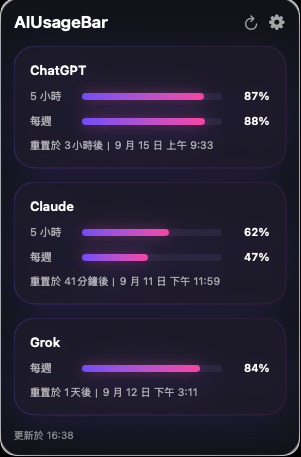

# Your AI usage, a glance away.

**AIUsageBar for macOS** puts remaining **ChatGPT, Claude, and Grok usage** in your menu bar. See available balances, usage windows, and reset times in one native panel, then get back to what you were doing.

**English + Traditional Chinese · macOS 13 or later · v3 Reliability**

[Check release availability](https://github.com/synok522-del/AIUsageBar/releases) · [Full README and installation guide](../README.md#download-and-install)

## One place to check what’s left

Connect the services you use, check remaining usage from the menu bar, and receive an optional notification when your remaining allowance falls below 20%. Enable launch at login to keep AIUsageBar close at hand.

*Existing screenshot shows Traditional Chinese. The app also supports English across the panel, settings, sign-in flows, notifications, and status messages.*

## Built for everyday interruptions

The v3 Reliability work makes refresh behavior more dependable when connections drop, providers throttle requests, or your Mac wakes from sleep.

| Improvement | What it means for you |
| --- | --- |
| Last-good data | Eligible readings from the last successful refresh remain available during temporary failures. |
| Stale status | Older readings are marked with last-update information, so you can tell when data needs refreshing. |
| 429 backoff | Refresh waits after rate limiting and respects the provider’s retry timing. |
| Sleep/wake refresh | Usage refreshes after wake, with repeated events combined and active backoff respected. |
| Per-provider single-flight / deadline | Repeated triggers share a refresh for each provider; stalled work times out and late results are discarded. |
| Account switching protection | Previous-account refresh work and cached readings cannot overwrite the new account’s state. |
| Grok recovery | Improved session recovery and clear sign-in requests when user action is required. |

Readings depend on what each provider exposes for your account. Temporary failures may show stale data or require you to sign in again.

## English version, with Traditional Chinese included

Use AIUsageBar in **English or Traditional Chinese** through macOS language preferences. English is the fallback language. Both localizations keep the focus on remaining usage and clear provider status.

## Get AIUsageBar

The designated final artifact is **`AIUsageBar-1.0.0-build4.dmg`**, version **1.0.0 (4)**: **Developer ID signed, Apple notarized, stapled, and Gatekeeper accepted**. “v3” refers to the reliability work, not the app’s version number.

**Artifact provenance:** this DMG was built from product source SHA `df65e6b9541721eefc7b18fb4365c12f7a2aa10a`. The later release documentation commit `ee62a668dc32f2a46cd6c0ec3ff9f7f311809546` is documentation-only and is not the binary's build source, so the DMG was not built from that documentation HEAD. Subsequent test and audit cleanup commits leave the production source unchanged.

**Download pending publication:** as of September 13, 2026, this exact DMG is not yet publicly available on GitHub Releases. The existing `v1.0.0` asset has a different filename and checksum and is not this designated artifact.

When published, download the exact file, verify the [SHA-256 in the README](../README.md#download-and-install), open the DMG, and drag AIUsageBar to Applications. Launch it and connect your providers in Settings. Requires macOS 13.0 or later and the corresponding provider accounts.

[View GitHub Releases](https://github.com/synok522-del/AIUsageBar/releases)

## Local credentials, direct provider access

Credentials and session tokens are stored in macOS Keychain; website cookies remain in the local WebKit data store. Usage is retrieved from provider endpoints. The project has no AIUsageBar backend or analytics endpoint.

## 繁體中文

在 macOS 選單列隨時查看 **ChatGPT、Claude、Grok 剩餘用量**。支援英文與繁體中文，搭配自動更新、低用量通知與登入時啟動。

v3 穩定性改善包含 last-good、stale 標示、429 退避重試、睡眠喚醒更新、各服務獨立 single-flight／deadline、切換帳號保護與 Grok 復原。正式安裝檔 `AIUsageBar-1.0.0-build4.dmg` 已簽署並通過 Apple 公證、staple 與 Gatekeeper 驗證，**目前仍待公開下載**。

---

AIUsageBar is an independent project, unaffiliated with OpenAI, Anthropic, or xAI. Provider changes may affect sign-in or usage retrieval.
